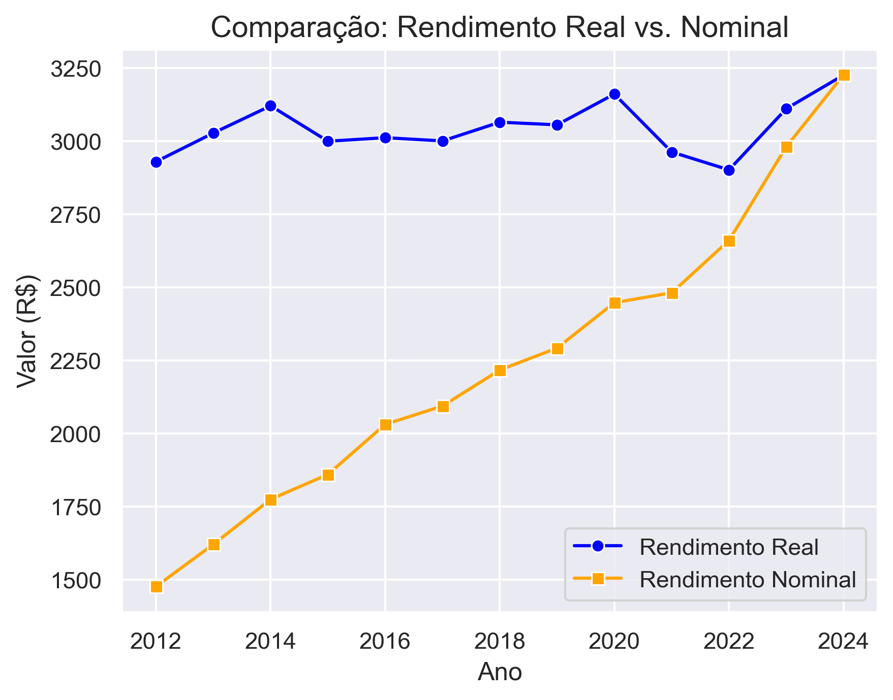
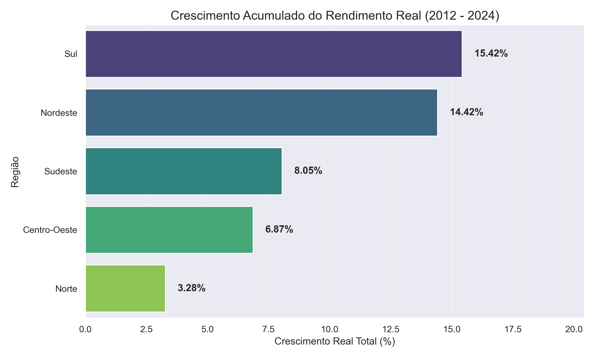

📊 Análise Visual
1. Panorama Nacional: Impacto Inflacionário no Rendimento Médio
Este gráfico apresenta a evolução do rendimento no Brasil como um todo, confrontando os valores nominais (recebidos na época) com os valores reais (ajustados pelo IPCA).

Análise: O distanciamento progressivo entre as linhas (o "gap" inflacionário) demonstra visualmente a Ilusão Monetária. Embora o rendimento nominal apresente uma curva de crescimento acentuada, o rendimento real revela uma estagnação no poder de compra, evidenciando que os aumentos salariais foram majoritariamente consumidos pela inflação do período.

2. Eficiência Regional: Crescimento Real Acumulado (2012-2024)
Este ranking compara o ganho de poder de compra efetivo entre as Grandes Regiões, utilizando 2012 como ano base.

Análise: O Sul e o Nordeste destacam-se com os maiores crescimentos reais acumulados (15,42% e 14,42%, respectivamente). Este dado é crucial para o projeto, pois revela um processo de convergência econômica onde o Nordeste, apesar de possuir o menor rendimento absoluto, foi a segunda região que mais conseguiu expandir seu poder de compra proporcionalmente na última década.

👤 Autor

José Antônio da Silva Estudante de Ciência de Dados (3º Semestre) na Faculdade Descomplica.

---

---

### 🤝 Conecte-se comigo
Para discussões sobre Engenharia de Dados, parcerias em projetos de Sports Analytics ou oportunidades profissionais:

---
